# Overview
In this project, you'll develop and demonstrate your skills in using a variety of industry leading tools, especially Microsoft Azure, to create disposable test environments and run a variety of automated tests with the click of a button. Additionally, you'll monitor and provide insight into your application's behavior, and determine root causes by querying the application’s custom log files.

# Getting Started
Before you deploy the infrastructure, you will need to:
* Azure & Github Account
* Clone the repository
* Creating a Azure App service
* Deploying the App with Azure Pipelines
* Terraform
* JMeter
* Postman
* Python
* Selenuim

# Instructions

## Azure pipeline
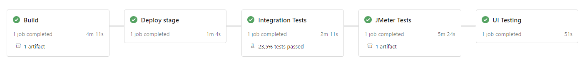

## Build Infrastructure with terraform
Terraform init
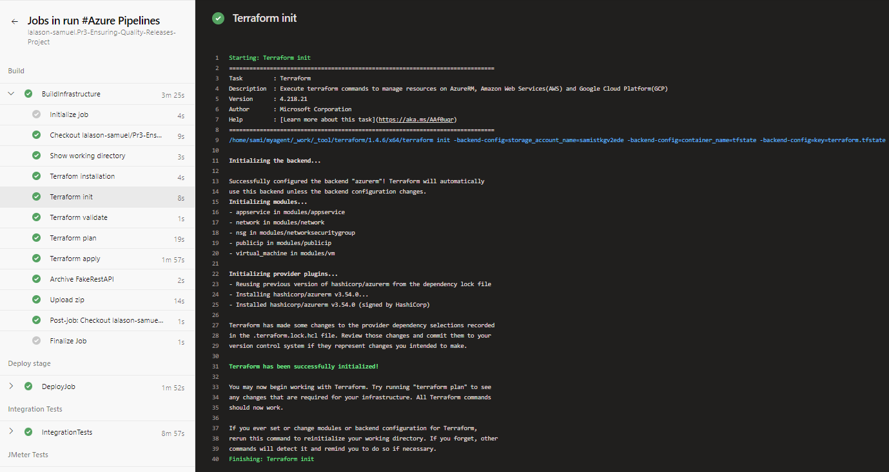
Terraform apply
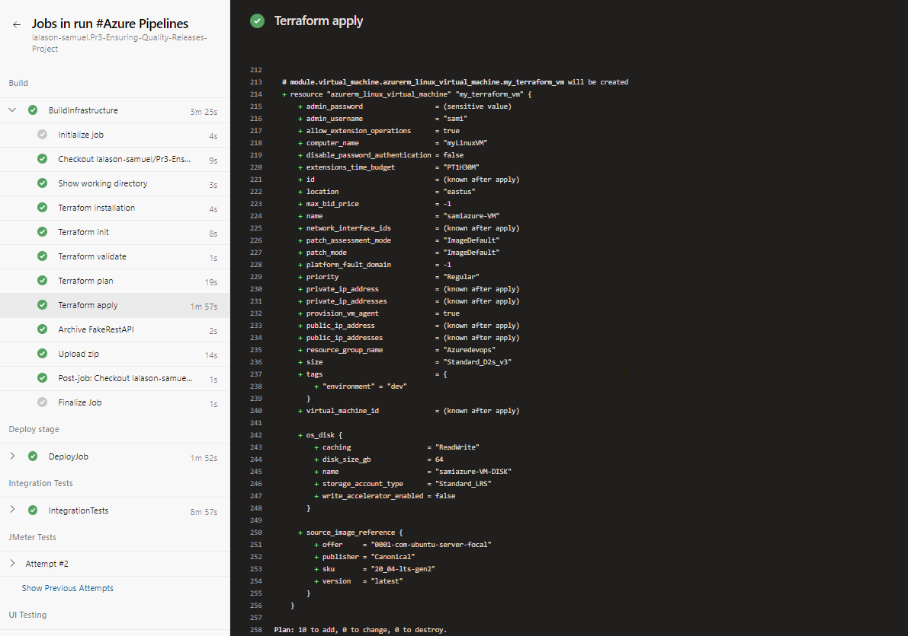
Liste of ressources

## Deploy to Azure Web App
Deploy fake rest api
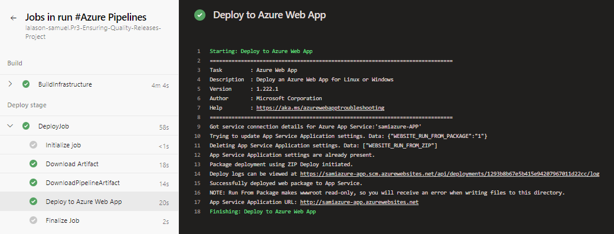

## Integration tests
Pipeline data validation
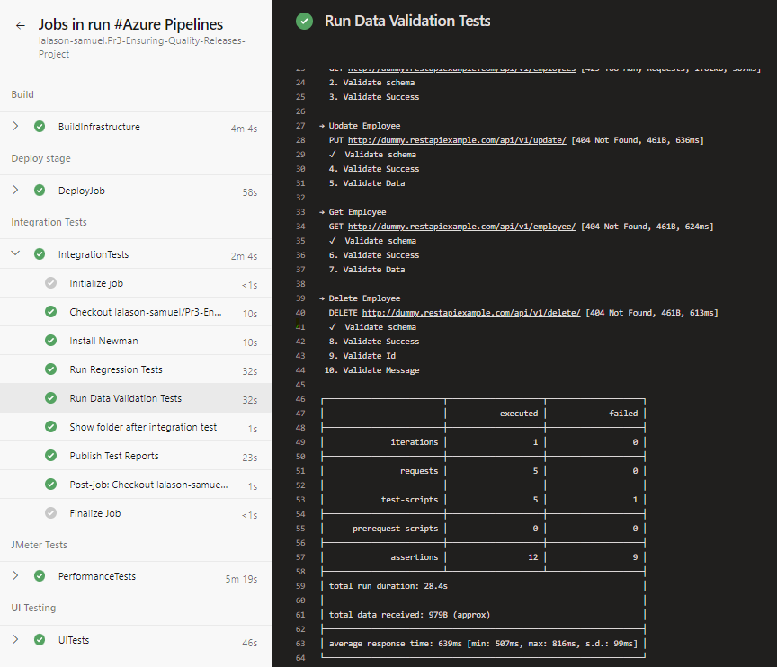
Publish data validation
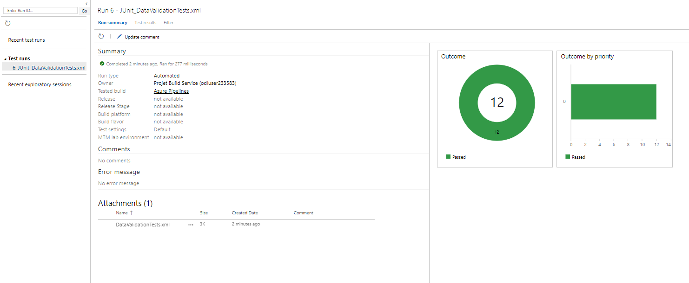

Pipeline regression
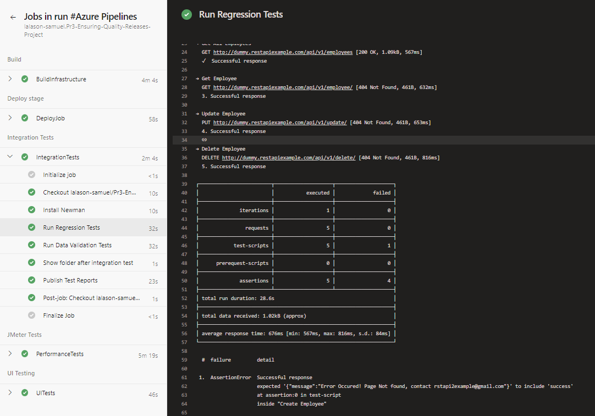
Publish regression
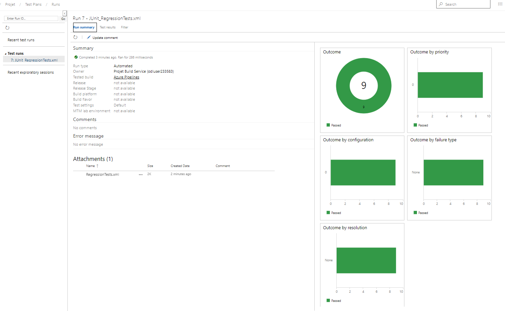

## JMeter tests
Pipeline Endurance test
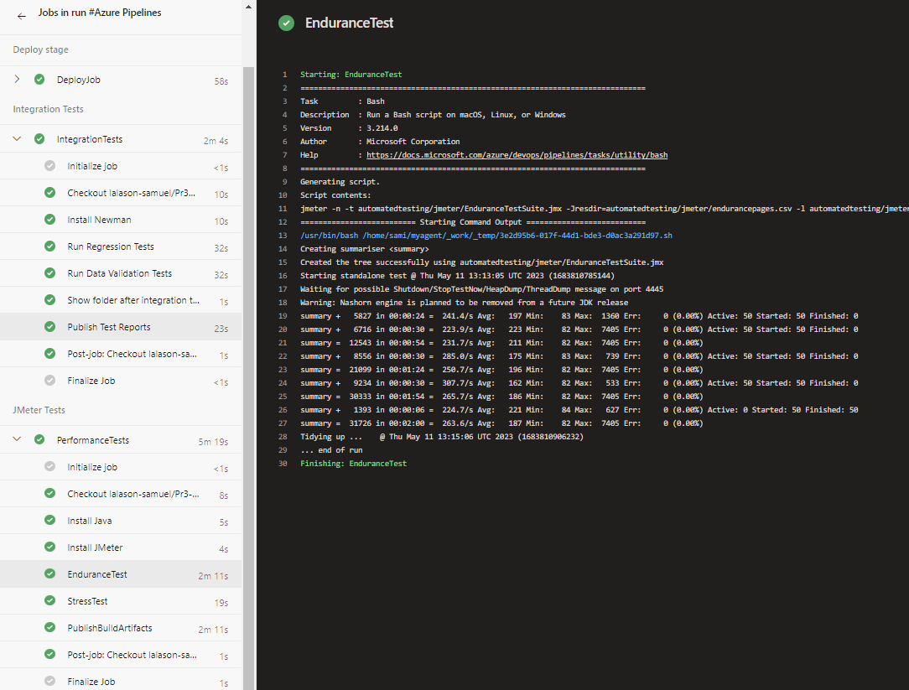
Report Stress test
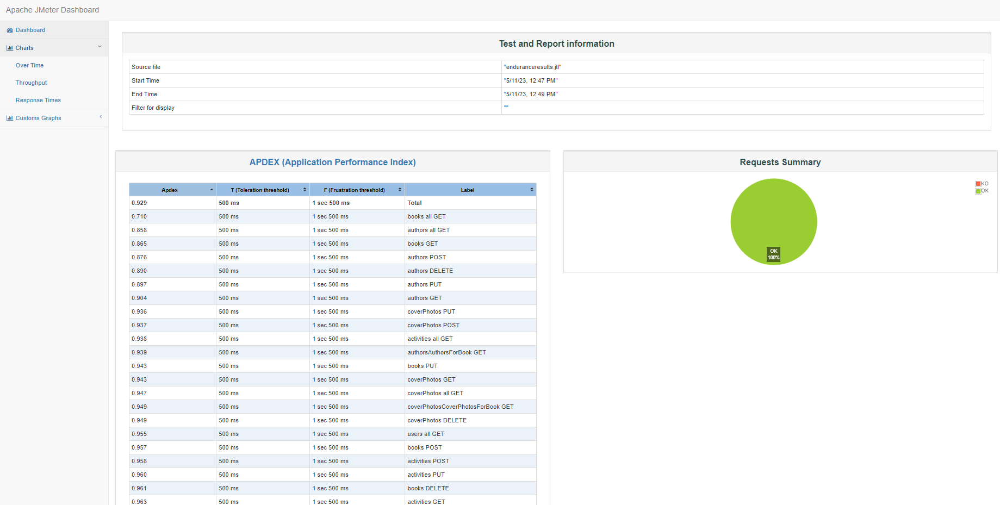

Pipeline Stress test
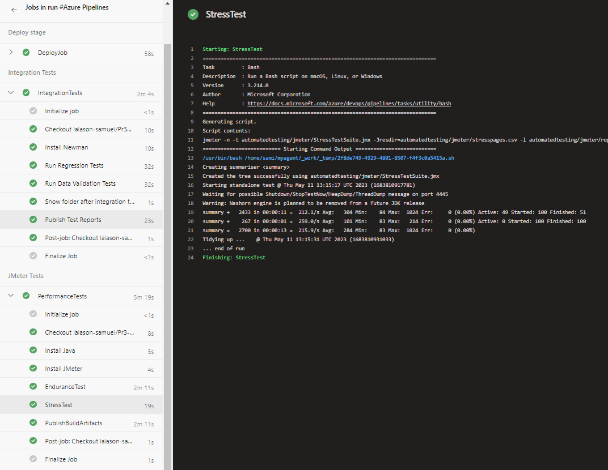
Report Stress test
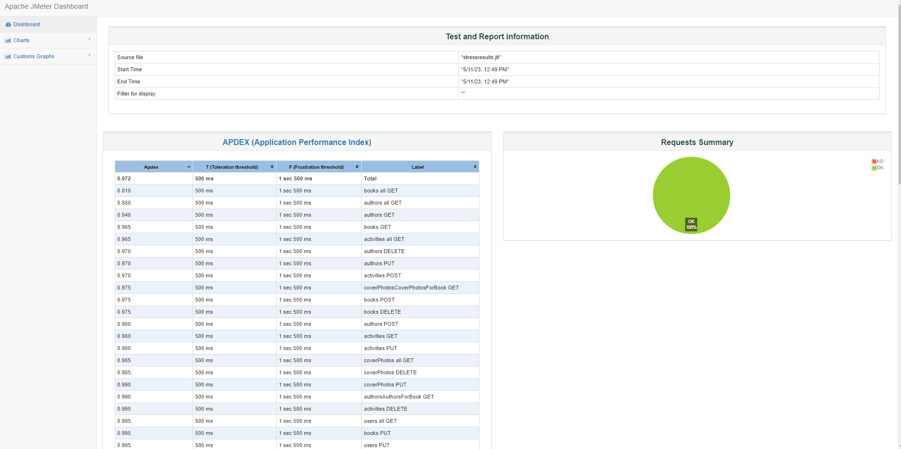

## UI tests with selenium
Pipeline UI test
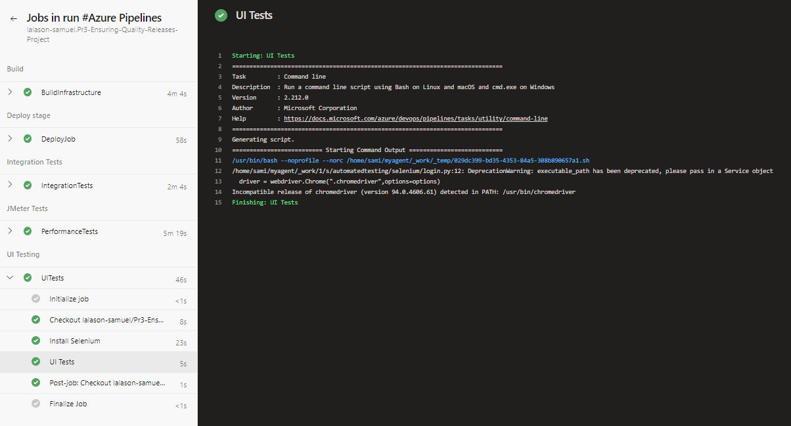
Logs by ui testing
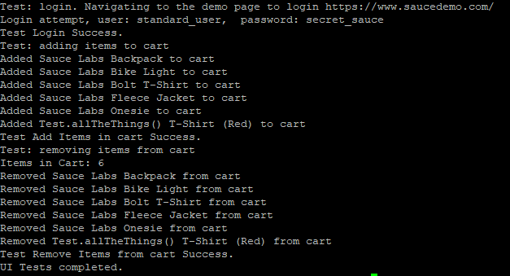

## Monitoring Azure Webapp
Alerts monitoring send mail
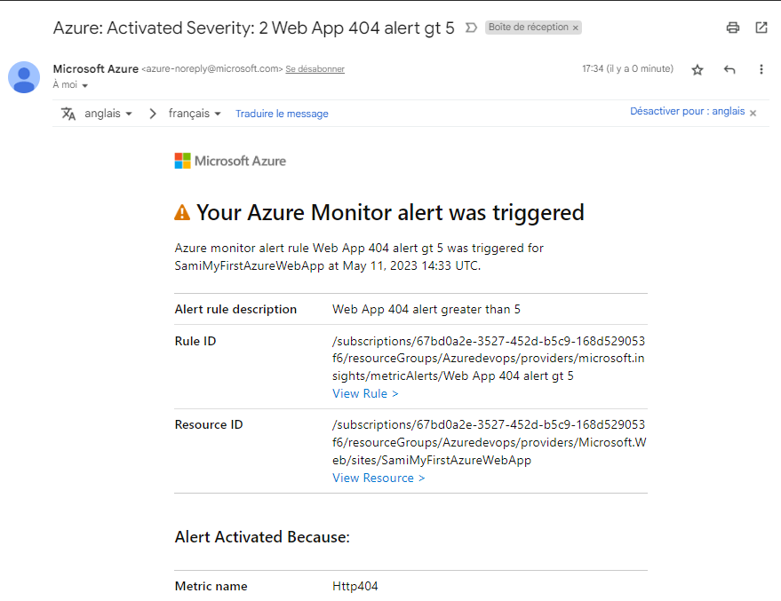